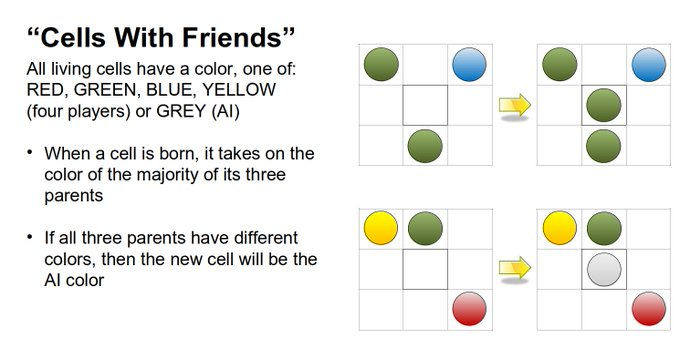

# Cells With Friends

### Summary:

Cells have extra information about where they were spawned from.

### Details:

1. Cells have a Color, either
    1. Player :
        1. Red
        1. Green
        1. Blue
        1. Yellow
    1. AI :
        1. Grey 
1. When a cell is born, it takes on the color of either:
    1. The majority of it's three parents.
    1. Grey(AI) in the case of a three way tie.

