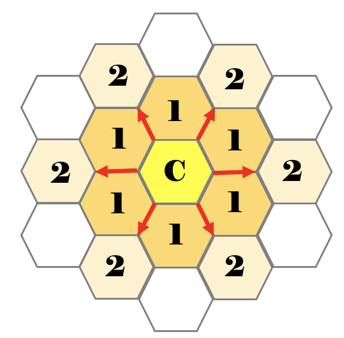

# Hexagonal Board

### Summary:

Hexigon grid instead of square.

### Details:

1. The grid is arranged as hexagons, with each cell having 6 neighbors.
1. Each Cell also has 6 second-level neighbors, that follow the spokes of the grid.
    1. These only count 30% as much (0.3 per neighbor)
1. Death
    1. Starvation occurs below 2.0
    1. Overpopulation occurs above 3.3
1. Birth 
    1. Birth occurs between [2.3 - 2.9] inclusive. 

