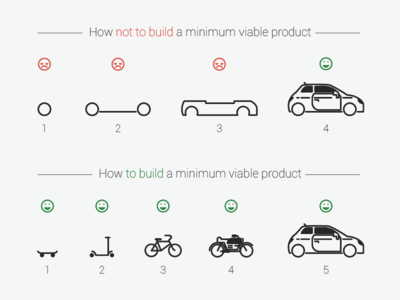

# Minimal Viable Product (MVP)

### Summary:

Practise delivering incremental value
### Details:
Your goal is to break the problem down into small, but useful increments that you can deliver to a customer. At the completion of each one, give it a version number.

### Example:

