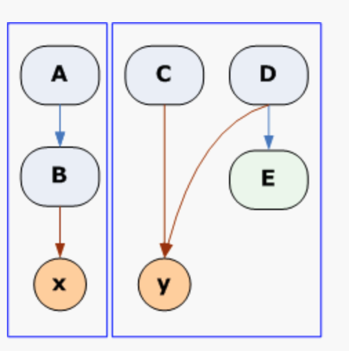

# Single Responsibility Principle (SRP) 

### Summary:

Very focused pieces

### Details:

When thinking about change resiliency, it’s important to think about creating code with high cohesion and low coupling.  One way to achieve this is with the Single Responsibility Principle.

Each and every method should be responsible for one and only one thing

Each class should only contain related methods

Exactly one assert per test

Methods a and b are related if:

1. they both access the same class-level variable, or
2. a calls b, or b calls a.

### Example

DO THIS:

NOT THIS

In the above diagram, x and y are variables. A, B, C, D and E are methods. The blue boxes represent classes. A&B are in the same class because they are related. C, D and E are also in the same class because they are related. A and C are not in the same class because they are not related.
