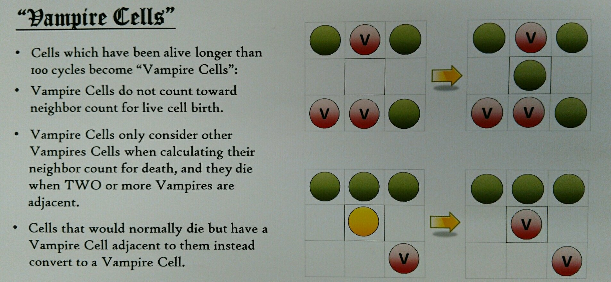

# Vampire Cells

### Summary:

Some cells feed off of their neighbors.

### Details:

1. Non-vampire Lifecycle
    1. Birth: Dead cells with 3 live (non-vampire) neighbors will come alive next round
    1. Staying Alive: Live cells with 2 or 3 neighbors of any type stay alive 
    1. Death by starvation: Live cells with 1 or less neighbors of any type die
    1. Death by overpopulation: Live cells with 4 or more neighbors of any type die
  
1. Vampire Lifecycle:
    1. Birth by old age: a cell has been alive longer than 100 cycles, it becomes a "Vampire Cell"
    1. Conversion: a non vampire cell that is dying next to 1 or more vampires becomes a vampire
    1. Death by over population:  a vampire cell with 2 or more vampires adjacent will die

### Exploration

